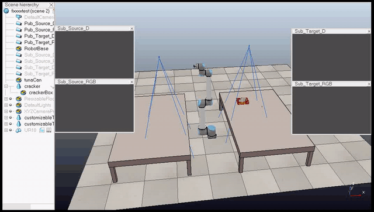

# Suction Arm Manipulator Robot
Simulate the Suction Arm Manipulator Robot to pick up daily objects inspired by the Amazon Robotics Challenge.

[Open Full Video](https://youtu.be/cmVsOR96NVk)

## Dependencies
* [VREP PRO EDU 3.6.2](http://coppeliarobotics.com/ubuntuVersions.html)
* [ROS Kinetic](https://wiki.ros.org/kinetic/Installation) 

## How to Run

1. In the terminal run `roscore`.
2. Open the `SuctionRobot.ttt` in [simulation](https://github.com/reshalfahsi/arm-suction-sim/tree/master/simulation) folder using VREP and run the simulation.
3. In the other terminal run the `RobotAI.sh` inside the [simulation](https://github.com/reshalfahsi/arm-suction-sim/tree/master/simulation) folder.
4. Enjoy!

## Contributor
* Kevin Aldian Winanta ([kevin.aldian.winanta@mail.ugm.ac.id](mailto:kevin.aldian.winanta@mail.ugm.ac.id))
* Resha Dwika Hefni Al-Fahsi ([resha.dwika.hefni.alfahsi@mail.ugm.ac.id](mailto:resha.dwika.hefni.alfahsi@mail.ugm.ac.id))

